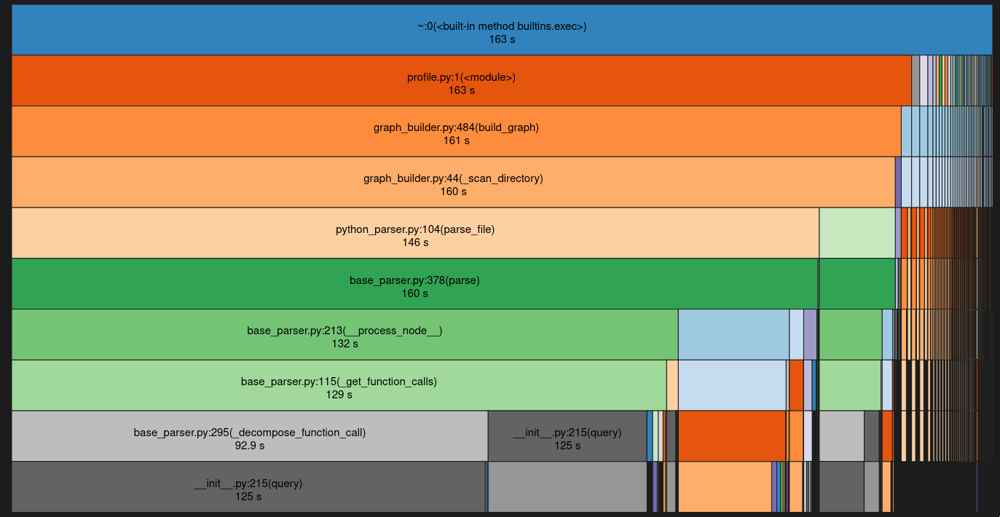

# Initial Profiling
```
Execution time: 169.24094414710999 seconds
         67774079 function calls (62918269 primitive calls) in 169.241 seconds

   Ordered by: cumulative time

   ncalls  tottime  percall  cumtime  percall filename:lineno(function)
        1    0.000    0.000  169.241  169.241 /home/juan/devel/code-base-agent/src/blar_graph/graph_construction/core/graph_builder.py:484(build_graph)
   3452/1    0.100    0.000  168.106  168.106 /home/juan/devel/code-base-agent/src/blar_graph/graph_construction/core/graph_builder.py:44(_scan_directory)
     1370    0.126    0.000  167.400    0.122 /home/juan/devel/code-base-agent/src/blar_graph/graph_construction/languages/base_parser.py:378(parse)
     2150    0.025    0.000  153.638    0.071 /home/juan/devel/code-base-agent/src/blar_graph/graph_construction/languages/python/python_parser.py:104(parse_file)
    13570    0.464    0.000  137.952    0.010 /home/juan/devel/code-base-agent/src/blar_graph/graph_construction/languages/base_parser.py:213(__process_node__)
    13570    0.935    0.000  134.529    0.010 /home/juan/devel/code-base-agent/src/blar_graph/graph_construction/languages/base_parser.py:115(_get_function_calls)
    77584    0.048    0.000  129.552    0.002 /home/juan/devel/code-base-agent/venv/lib/python3.11/site-packages/tree_sitter/__init__.py:215(query)
    77584  129.504    0.002  129.504    0.002 {built-in method tree_sitter.binding._language_query}
    48688    0.272    0.000   96.266    0.002 /home/juan/devel/code-base-agent/src/blar_graph/graph_construction/languages/base_parser.py:295(_decompose_function_call)
     1370    0.023    0.000   22.969    0.017 /home/juan/devel/code-base-agent/venv/lib/python3.11/site-packages/llama_index/core/node_parser/interface.py:128(get_nodes_from_documents)
     1370    0.048    0.000   22.265    0.016 /home/juan/devel/code-base-agent/venv/lib/python3.11/site-packages/llama_index/core/instrumentation/dispatcher.py:244(wrapper)
     1370    0.086    0.000   22.060    0.016 /home/juan/devel/code-base-agent/venv/lib/python3.11/site-packages/llama_index/packs/code_hierarchy/code_hierarchy.py:611(_parse_nodes)
624652/1370    2.901    0.000   19.062    0.014 /home/juan/devel/code-base-agent/venv/lib/python3.11/site-packages/llama_index/packs/code_hierarchy/code_hierarchy.py:409(_chunk_node)
        7    0.001    0.000   14.057    2.008 /home/juan/devel/code-base-agent/src/blar_graph/graph_construction/languages/javascript/javascript_parser.py:109(parse_file)
704702/691132    0.715    0.000   10.738    0.000 /home/juan/devel/code-base-agent/venv/lib/python3.11/site-packages/pydantic/v1/main.py:332(__init__)
704702/691132    3.233    0.000    9.752    0.000 /home/juan/devel/code-base-agent/venv/lib/python3.11/site-packages/pydantic/v1/main.py:1030(validate_model)
2832053/2178634    1.931    0.000    6.361    0.000 /home/juan/devel/code-base-agent/venv/lib/python3.11/site-packages/pydantic/v1/fields.py:850(validate)
    12200    0.035    0.000    5.129    0.000 /home/juan/devel/code-base-agent/venv/lib/python3.11/site-packages/llama_index/packs/code_hierarchy/code_hierarchy.py:334(_get_node_signature)
2810352/12200    2.074    0.000    4.905    0.000 /home/juan/devel/code-base-agent/venv/lib/python3.11/site-packages/llama_index/packs/code_hierarchy/code_hierarchy.py:338(find_start)
  2872140    2.913    0.000    3.801    0.000 /home/juan/devel/code-base-agent/venv/lib/python3.11/site-packages/pydantic/v1/main.py:351(__setattr__)
    67534    3.585    0.000    3.585    0.000 {method 'parse' of 'tree_sitter.Parser' objects}
```

## Visualization


## Observations
Biggest time consumer is the `language_query` method of the `tree_sitter.binding` module. This method is called 77584 times and takes 129.504 seconds to execute. 

Second biggest consumer is `get_nodes_from_documents` at 30s, which is also called in the `parse` method of the `BaseParser` class. 

It is used in the `_decompose_function_call` method of the `BaseParser` class.

Since the biggest time consumers correspond to calls to the 'llama_index' module, and these methods need to be called at least once for every file, the only way to optimize this is to parallelize the parsing the calls to the `llama_index` module.

# First Optimization Attempt
Parallelize the parsing of the nodes in the `parse` method of the `BaseParser` class.
```python
if max_workers > 0:
    with ThreadPoolExecutor(max_workers=max_workers) as executor:
        results = executor.map(
            lambda node: self.__process_node__(
                node,
                file_path,
                file_node["attributes"]["node_id"],
                global_graph_info,
                assignment_dict,
                documents[0],
                level,
            ),
            split_nodes,
        )

        for processed_node, relationships in results:
            node_list.append(processed_node)
            edges_list.extend(relationships)
```
## Profiling
```
execution time: 176.33099627494812 seconds
         65002763 function calls (60146961 primitive calls) in 176.331 seconds

   Ordered by: cumulative time

   ncalls  tottime  percall  cumtime  percall filename:lineno(function)
        1    0.000    0.000  176.331  176.331 /home/juan/devel/code-base-agent/src/blar_graph/graph_construction/core/graph_builder.py:484(build_graph)
   3452/1    0.103    0.000  175.220  175.220 /home/juan/devel/code-base-agent/src/blar_graph/graph_construction/core/graph_builder.py:44(_scan_directory)
     1370    0.130    0.000  174.500    0.127 /home/juan/devel/code-base-agent/src/blar_graph/graph_construction/languages/base_parser.py:379(parse)
     2150    0.041    0.000  158.815    0.074 /home/juan/devel/code-base-agent/src/blar_graph/graph_construction/languages/python/python_parser.py:104(parse_file)
    12246    0.052    0.000  133.540    0.011 /usr/lib/python3.11/threading.py:295(wait)
    50433  133.490    0.003  133.490    0.003 {method 'acquire' of '_thread.lock' objects}
     1290    0.008    0.000   85.548    0.066 /usr/lib/python3.11/concurrent/futures/_base.py:583(map)
     1290    0.115    0.000   85.541    0.066 /usr/lib/python3.11/concurrent/futures/_base.py:608(<listcomp>)
    12200    0.204    0.000   85.426    0.007 /usr/lib/python3.11/concurrent/futures/thread.py:161(submit)
    12200    0.068    0.000   85.039    0.007 /usr/lib/python3.11/concurrent/futures/thread.py:180(_adjust_thread_count)
     4875    0.019    0.000   84.528    0.017 /usr/lib/python3.11/threading.py:945(start)
     4875    0.022    0.000   84.349    0.017 /usr/lib/python3.11/threading.py:611(wait)
    13490    0.012    0.000   49.291    0.004 /usr/lib/python3.11/concurrent/futures/_base.py:612(result_iterator)
    12200    0.023    0.000   49.276    0.004 /usr/lib/python3.11/concurrent/futures/_base.py:314(_result_or_cancel)
    12200    0.026    0.000   49.232    0.004 /usr/lib/python3.11/concurrent/futures/_base.py:428(result)
     1370    0.024    0.000   22.875    0.017 /home/juan/devel/code-base-agent/venv/lib/python3.11/site-packages/llama_index/core/node_parser/interface.py:128(get_nodes_from_documents)
     1370    0.039    0.000   22.170    0.016 /home/juan/devel/code-base-agent/venv/lib/python3.11/site-packages/llama_index/core/instrumentation/dispatcher.py:244(wrapper)
     1370    0.079    0.000   21.981    0.016 /home/juan/devel/code-base-agent/venv/lib/python3.11/site-packages/llama_index/packs/code_hierarchy/code_hierarchy.py:611(_parse_nodes)
624652/1370    3.048    0.000   18.984    0.014 /home/juan/devel/code-base-agent/venv/lib/python3.11/site-packages/llama_index/packs/code_hierarchy/code_hierarchy.py:409(_chunk_node)
        7    0.000    0.000   15.997    2.285 /home/juan/devel/code-base-agent/src/blar_graph/graph_construction/languages/javascript/javascript_parser.py:109(parse_file)
704702/691132    0.708    0.000   10.555    0.000 /home/juan/devel/code-base-agent/venv/lib/python3.11/site-packages/pydantic/v1/main.py:332(__init__)
     1370    0.041    0.000    9.649    0.007 /home/juan/devel/code-base-agent/src/blar_graph/graph_construction/languages/base_parser.py:214(__process_node__)
704702/691132    3.291    0.000    9.581    0.000 /home/juan/devel/code-base-agent/venv/lib/python3.11/site-packages/pydantic/v1/main.py:1030(validate_model)
     1370    0.073    0.000    9.559    0.007 /home/juan/devel/code-base-agent/src/blar_graph/graph_construction/languages/base_parser.py:116(_get_function_calls)
     5391    0.004    0.000    8.936    0.002 /home/juan/devel/code-base-agent/venv/lib/python3.11/site-packages/tree_sitter/__init__.py:215(query)
     5391    8.932    0.002    8.932    0.002 {built-in method tree_sitter.binding._language_query}
```
## Observations
The execution time increased by 7 seconds. This is due to the overhead of creating the threads and the synchronization between them. The `acquire` method of the `thread.lock` object is the one that takes the most time.

# Second Optimization Attempt
Use the `concurrent.futures.ProcessPoolExecutor` instead of the `ThreadPoolExecutor`.
```python
if max_workers > 0:
            with ProcessPoolExecutor(max_workers=max_workers) as executor:
                futures = []

                for node in split_nodes:
                    futures.append(
                        executor.submit(
                            self.__process_node__,
                            node,
                            file_path,
                            file_node["attributes"]["node_id"],
                            global_graph_info,
                            assignment_dict,
                            documents[0],
                            level,
                        )
                    )

                for future in as_completed(futures):
                    processed_node, relationships = future.result()
                    node_list.append(processed_node)
                    edges_list.extend(relationships)
```

## Profiling
```
Execution time: 228.86374926567078 seconds
         55372113 function calls (50537390 primitive calls) in 228.864 seconds

   Ordered by: cumulative time

   ncalls  tottime  percall  cumtime  percall filename:lineno(function)
        1    0.000    0.000  228.864  228.864 /home/juan/devel/code-base-agent/src/blar_graph/graph_construction/core/graph_builder.py:484(build_graph)
   3452/1    0.141    0.000  227.905  227.905 /home/juan/devel/code-base-agent/src/blar_graph/graph_construction/core/graph_builder.py:44(_scan_directory)
     1370    0.317    0.000  227.033    0.166 /home/juan/devel/code-base-agent/src/blar_graph/graph_construction/languages/base_parser.py:379(parse)
     2150    0.065    0.000  220.369    0.102 /home/juan/devel/code-base-agent/src/blar_graph/graph_construction/languages/python/python_parser.py:104(parse_file)
    65582  126.261    0.002  126.261    0.002 {method 'acquire' of '_thread.lock' objects}
    13023    0.065    0.000  113.572    0.009 /usr/lib/python3.11/threading.py:611(wait)
    13490    0.173    0.000  113.511    0.008 /usr/lib/python3.11/concurrent/futures/_base.py:199(as_completed)
    13023    0.097    0.000  113.480    0.009 /usr/lib/python3.11/threading.py:295(wait)

```
## Observations
The execution time increased by 52 seconds. This is due to the overhead of creating the processes and the synchronization between them. The `acquire` method of the `_thread.lock` object is the one that takes the most time.

# Third Optimization Attempt
Replace recursive calls with a stack-based approach in `_scan_directory`.
```python
  # Using a stack to manage directories to scan
        stack = deque([(path, directory_node_id, level)])

        while stack:
            current_path, current_parent_id, current_level = stack.pop()

            for entry in os.scandir(current_path):
                if self._skip_file(entry.name):
                    continue
```

## Profiling
```
Execution time: 226.01672315597534 seconds
         88509843 function calls (82450375 primitive calls) in 226.017 seconds

   Ordered by: cumulative time

   ncalls  tottime  percall  cumtime  percall filename:lineno(function)
        1    0.000    0.000  226.017  226.017 /home/juan/devel/code-base-agent/src/blar_graph/graph_construction/core/graph_builder.py:493(build_graph)
        1    0.107    0.107  224.568  224.568 /home/juan/devel/code-base-agent/src/blar_graph/graph_construction/core/graph_builder.py:46(_scan_directory)
     2387    0.157    0.000  223.835    0.094 /home/juan/devel/code-base-agent/src/blar_graph/graph_construction/languages/base_parser.py:378(parse)
     3775    0.032    0.000  210.420    0.056 /home/juan/devel/code-base-agent/src/blar_graph/graph_construction/languages/python/python_parser.py:104(parse_file)
    18760    0.506    0.000  185.540    0.010 /home/juan/devel/code-base-agent/src/blar_graph/graph_construction/languages/base_parser.py:213(__process_node__)
    18760    1.132    0.000  181.703    0.010 /home/juan/devel/code-base-agent/src/blar_graph/graph_construction/languages/base_parser.py:115(_get_function_calls)
   107092    0.061    0.000  175.696    0.002 /home/juan/devel/code-base-agent/venv/lib/python3.11/site-packages/tree_sitter/__init__.py:215(query)
   107092  175.635    0.002  175.635    0.002 {built-in method tree_sitter.binding._language_query}
    67559    0.326    0.000  130.997    0.002 /home/juan/devel/code-base-agent/src/blar_graph/graph_construction/languages/base_parser.py:295(_decompose_function_call)
     2387    0.033    0.000   29.733    0.012 /home/juan/devel/code-base-agent/venv/lib/python3.11/site-packages/llama_index/core/node_parser/interface.py:128(get_nodes_from_documents)
     2387    0.055    0.000   28.766    0.012 /home/juan/devel/code-base-agent/venv/lib/python3.11/site-packages/llama_index/core/instrumentation/dispatcher.py:244(wrapper)
     2387    0.113    0.000   28.461    0.012 /home/juan/devel/code-base-agent/venv/lib/python3.11/site-packages/llama_index/packs/code_hierarchy/code_hierarchy.py:611(_parse_nodes)
822072/2387    3.710    0.000   24.466    0.010 /home/juan/devel/code-base-agent/venv/lib/python3.11/site-packages/llama_index/packs/code_hierarchy/code_hierarchy.py:409(_chunk_node)
932245/913485    0.970    0.000   13.932    0.000 /home/juan/devel/code-base-agent/venv/lib/python3.11/site-packages/pydantic/v1/main.py:332(__init__)
        7    0.001    0.000   13.770    1.967 /home/juan/devel/code-base-agent/src/blar_graph/graph_construction/languages/javascript/javascript_parser.py:109(parse_file)
932245/913485    4.384    0.000   12.606    0.000 /home/juan/devel/code-base-agent/venv/lib/python3.11/site-packages/pydantic/v1/main.py:1030(validate_model)
3777296/2886519    2.538    0.000    8.249    0.000 /home/juan/devel/code-base-agent/venv/lib/python3.11/site-packages/pydantic/v1/fields.py:850(validate)
    16373    0.047    0.000    6.596    0.000 /home/juan/devel/code-base-agent/venv/lib/python3.11/site-packages/llama_index/packs/code_hierarchy/code_hierarchy.py:334(_get_node_signature)
3374262/16373    2.522    0.000    6.326    0.000 /home/juan/devel/code-base-agent/venv/lib/python3.11/site-packages/llama_index/packs/code_hierarchy/code_hierarchy.py:338(find_start)
```

## Observations
The execution time increased by 57 seconds

# Fourth Optimization Attempt
Instead of creating a new ThreadPool on every call to `parse`, create a ThreadPool on the `BaseParser` class and reuse it.
```python
if not hasattr(self, 'executor'):
            self.executor = ThreadPoolExecutor(max_workers=8)

        if split_nodes:
            results = self.executor.map(
                lambda node: self.__process_node__(
                    node,
                    file_path,
                    file_node["attributes"]["node_id"],
                    global_graph_info,
                    assignment_dict,
                    documents[0],
                    level,
                ),
                split_nodes,
            )

            for processed_node, relationships in results:
                node_list.append(processed_node)
                edges_list.extend(relationships)
```

## Results
Time decreased by 3 seconds, still too much overhead. Threading needs to be implemented at a higher level.

One possible solution is to add all nodes to a queue and have a pool of threads that process the nodes in the queue. This way, we can avoid having to wait for all nodes to be processed before starting the next batch.
